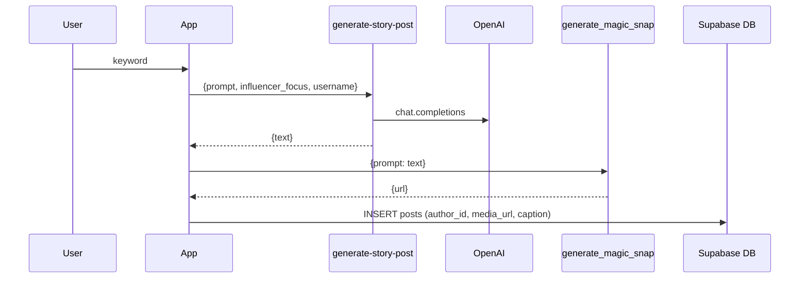

# Insta Story Generator – Feature Documentation

## Why
Creators often struggle to craft engaging, on-brand stories quickly.
The "Insta Story" button lets them type a *single keyword* and instantly receive a professionally-worded prompt, AI-generated image, and caption – ready to post.
This reduces creative friction and showcases the combined power of LLM + image generation already present in Snappy.

## What It Does
1. User taps the 📸 Insta Story FAB on the Stories screen.
2. A modal asks for a word or phrase ("sunset", "ramen", "road trip"…).
3. Backend edge function **generate-story-post** (GPT-3.5-turbo) returns one formatted string:
   ```
   Instagram Influencer Post. Description: Vibrant sunset over Tokyo’s skyline

   Overlaid Caption: Golden hour goals 🌇
   ```
4. Full string is fed to existing **generate_magic_snap** which produces a 512×512 PNG.
5. User previews image + caption → Reject or Post.
6. On *Post* the image is saved to `posts` (stories) table with the caption.

## Technical Flow


### generate-story-post Edge Function
* Language: Deno (same stack as other functions)
* Model: `gpt-3.5-turbo`, temperature 0.7, max_tokens 120
* Ensures strict two-line format (checked with simple regex).
* CORS headers and verbose `console.log` timing.

### Front-end Service `createInstaStory`
* Orchestrates both network calls.
* Parses **Overlaid Caption** with regex.
* Returns `{ url, caption }` to UI.

### UI / State
* React state machine: `idle → prompt → image`.
* Modal shows live status text and spinners for both network rounds.
* `stories` list refreshes automatically after posting.

## Future Ideas
* Allow editing caption before posting.
* Let user pick between 1:1 / 9:16 aspect ratios.
* Add queue so user can swipe through multiple image options.
* Charge "creative credits" to discourage spam in production.

---
*Added 2025-06-29*